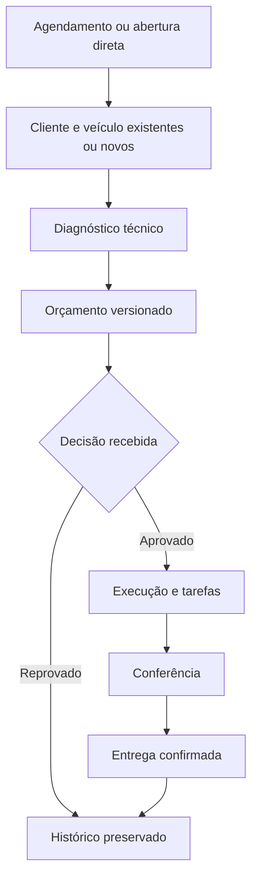
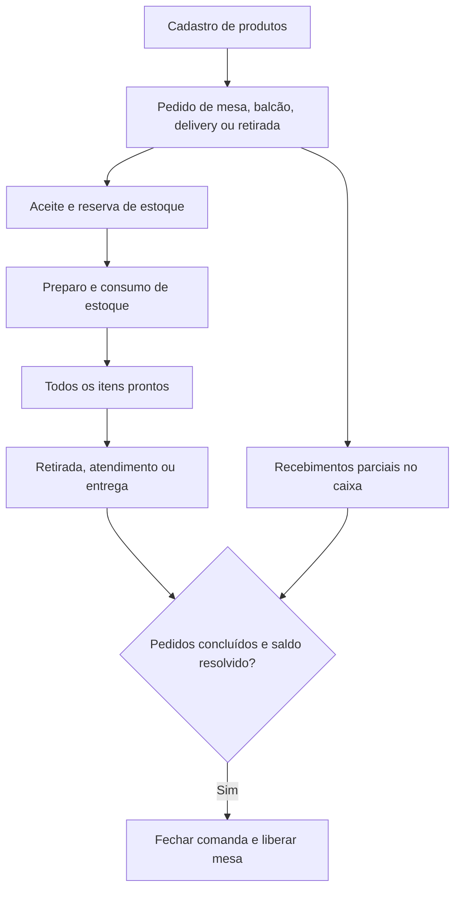
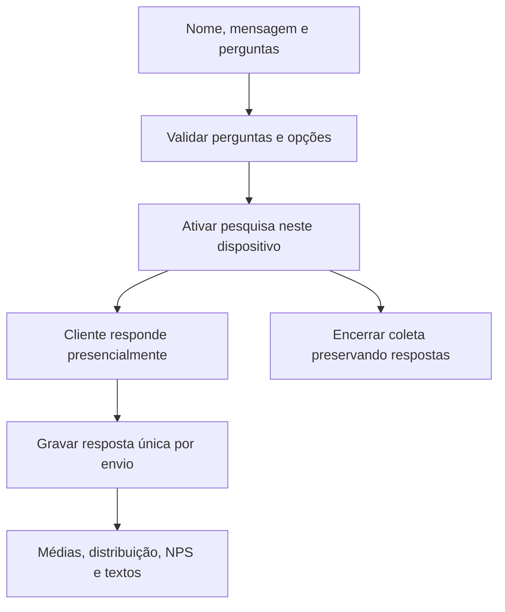
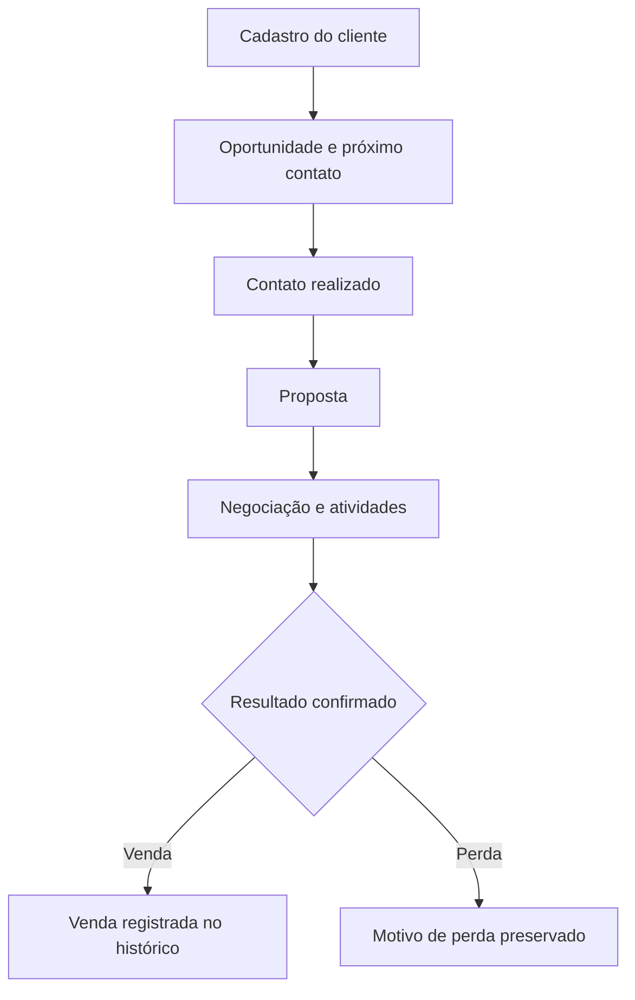
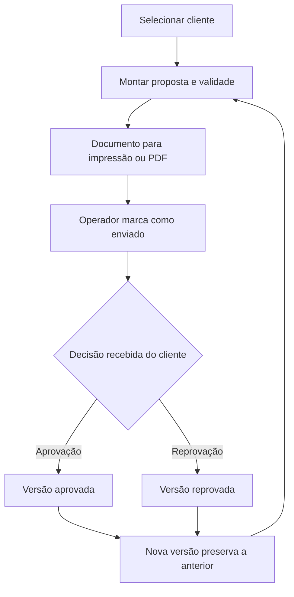

# CRM PLUS — aplicativos e fluxos operacionais

## Entrega atual

Os cinco aplicativos do catálogo possuem áreas operacionais próprias, acesso direto sem login, tema claro por padrão, alternância de tema, menu recolhível e configurações. A landing aprovada foi preservada; seus botões de acesso agora abrem os apps.

| Aplicativo | Entrada | Áreas |
| --- | --- | --- |
| Zeus | `/zeus` | Hoje, agendamentos, atendimentos, clientes e veículos, histórico, configurações |
| Artemis | `/artemis` | Serviço de hoje, pedidos, mesas, cozinha, cardápio, caixa, estoque, clientes, relatórios, configurações |
| Athena Pesquisa | `/athena-pesquisa` | Estúdio, pesquisas, respostas, resultados, configurações |
| Kronos | `/kronos` | Próxima conversa, oportunidades, atividades, clientes, histórico, configurações |
| Athena Orçamentos | `/athena-orcamentos` | Propostas, orçamentos, clientes, configurações |

`/entrar` permite escolher o aplicativo. `/login?app=...`, `/cadastro?app=...` e as rotas de login/cadastro de cada app redirecionam para a operação, conforme a instrução de adiar a autenticação. Não existe um login fictício nem uma sessão que alegue ser autenticada.

## Dados nesta etapa sem autenticação

A persistência implementada é local no navegador, com uma chave diferente por aplicativo (`crmplus:<app>:operations:v1`). Todos os apps começam sem dados. A conta operacional usada para revisar os fluxos pertence ao navegador; não representa uma conta multiusuário autenticada.

As gravações são feitas sobre uma cópia, verificadas antes de persistir e protegidas por Web Locks quando disponíveis. Abas do mesmo navegador recebem alterações por `storage`. Isso não é sincronização entre dispositivos, isolamento de empresas no servidor ou uma substituição do RLS.

O operador pode exportar uma cópia JSON, restaurar uma cópia do mesmo app e exportar listas em CSV. Limpar os dados do navegador apaga os registros locais. O produto informa isso no rodapé, nas configurações e na ajuda. Fotos locais do Zeus aceitam JPEG, PNG e WebP até 750 KB por arquivo; não há upload para R2 nesta entrega.

## Zeus

A agenda possui visão diária e semanal, criação, reagendamento, cancelamento e abertura de OS idempotente. A busca de identificação apresenta veículos da própria base para seleção explícita. É possível cadastrar cliente e veículo dentro da abertura de OS. Número, tipo, etapa e situação são separados. Diagnóstico, tarefas, observações, fotos e linha do tempo pertencem à OS.

O orçamento possui itens, marcas, quantidades, valores em centavos, desconto, validade e versões. A aprovação nesta fase é **registrada pelo operador após receber a decisão do cliente**, com descrição obrigatória da origem da confirmação. Não é uma aprovação autenticada por link público. Revisões preservam o conteúdo anterior e exigem nova decisão. O relatório e o orçamento podem ser impressos ou salvos como PDF pelo navegador.

A execução possui tarefas separadas dos itens financeiros: atualizar uma tarefa não altera uma proposta aprovada. O encerramento exige confirmação e move o atendimento para o histórico. Registros cancelados e reprovados também deixam a lista ativa.

### Configuração da oficina

Os nomes de identificação, ativo e medição são configuráveis. Mudar “Placa” para “Série” não renomeia IDs internos. Os módulos de agendamento, diagnóstico e orçamento podem ser desativados. O fluxo se recompõe; desativar orçamento com aprovações pendentes é bloqueado. A versão atual não oferece reordenação livre de etapas.

## Artemis

O catálogo cadastra categorias, descrições, preços, preparo estimado, disponibilidade e informações de ingredientes/alergênicos informadas pelo restaurante. A mesma base alimenta o lançamento de pedidos e a prévia local do cardápio. Os pedidos preservam o preço e o nome dos itens no momento do registro.

Pedidos são lançados pela equipe e podem ser aceitos, preparados item a item, liberados, concluídos e cancelados com motivo. Delivery tem situação de entrega separada. Operação e pagamento são independentes. A cozinha só conclui preparo quando todos os itens estão prontos.

Mesas reais são cadastradas pelo operador. Cada abertura de comanda cria um período próprio. Vários pedidos podem compor uma comanda. Transferência de pedido preserva seu vínculo com a comanda de destino mesmo quando a mesa foi aberta após o pedido. A mesa não é liberada com pedidos pendentes, saldo a receber ou devolução pendente.

Há abertura e fechamento de um turno de caixa por vez, pagamentos parciais em dinheiro/Pix/cartões, suprimentos, sangrias, despesas, conferência de dinheiro e registro manual de devolução integral. Pix e cartões não entram no valor esperado na gaveta. Fechamentos com diferença exigem justificativa. Um recebimento não pode exceder o saldo da conta.

Produtos com estoque controlado são reservados no aceite e consumidos uma única vez ao iniciar preparo. Cancelar antes do preparo libera a reserva; cancelar depois não devolve ingredientes automaticamente. Entradas e saídas manuais registram motivo e data.

Relatórios por período separam vendas de recebimentos, exibem vendas por canal e pagamentos por forma. O CSV exporta os dados reais exibidos.

## Athena Pesquisa

O editor aceita notas de 0 a 10, notas de 1 a 5, texto e escolha única, com respostas obrigatórias ou opcionais. Ativar congela as perguntas para preservar a comparabilidade. Coleta presencial no mesmo dispositivo, contato opcional mediante escolha do respondente, exportação CSV e leitura dos resultados. O NPS é calculado apenas para perguntas de 0 a 10, com base e fórmula explícitas. Sem respostas, o app exibe estado vazio; não fabrica resultados.

## Kronos

A primeira tela prioriza os próximos contatos, incluindo atrasos reais. O pipeline organiza oportunidades em quatro etapas e mantém ganhos/perdas no histórico. Contatos, valores, contexto, retornos e tarefas são editáveis. Atividades concluídas geram eventos. Encerrar negociação exige descrição do fechamento ou motivo da perda.

## Athena Orçamentos

Registro próprio de clientes e orçamentos, busca, status, valor, validade, exportação, documento imprimível, revisões e histórico de decisões. Os registros não compartilham chaves com Zeus nem com o Athena Pesquisa, apesar do nome comum no catálogo aprovado.

## Infraestrutura e funções ainda pendentes

Esta entrega **não afirma integrar Supabase, Cloudflare R2, Groq, autenticação ou links públicos**. Não foram criados projetos externos nem reutilizadas bases de outros apps. Não há endpoint aberto que permita acessar dados de empresas sem autenticação.

A fase de infraestrutura deve conectar um projeto Supabase, uma API, um bucket R2 e credenciais Groq exclusivos de cada aplicativo, com conta operacional vinculada ao usuário e RLS. O titular e os três usuários adicionais, as permissões, as transações concorrentes no servidor, os tokens revogáveis de aprovação/relatório/pesquisa e o envio de pedidos online dependem dessa fase.

No Artemis, os requisitos completos de variantes, adicionais com limites, combos, fotos em R2, QR de mesas, pedidos públicos, áreas/horários validados no servidor, cupons, taxas de serviço, ficha técnica por insumo/fornecedores, divisão por pessoas com troco, estorno parcial e conferência por forma de pagamento ainda não estão implementados. A configuração de bairros e horários é uma referência para a equipe; não é uma validação automatizada. A baixa atual controla produtos diretamente.

No Zeus, faltam edição completa do cadastro de ativos, filtros combinados de período/tipo/etapa, links externos de aprovação e relatório, anexos compartilháveis escolhidos por link, edição de etapas e gestão multiusuário.

## Verificação executada

- `npm run build`: compilação de produção e geração de 62 páginas.
- `node_modules/.bin/tsc --noEmit`: TypeScript estrito.
- `node --test tests/operations.test.mjs` (Node 24): 16 testes de regras reais, incluindo centavos, desconto, vínculos de cliente/ativo, repetição de abertura de OS, sequência de etapas, versões de orçamento, reserva/consumo/cancelamento de estoque, pagamentos, caixa e fechamento/transferência de comanda.
- Não foi realizada uma sessão de teste visual em navegador, nem testes de infraestrutura remota ou de isolamento autenticado.

As fixtures dos testes estão restritas a `tests/`; a aplicação não importa nem semeia dados de demonstração.
